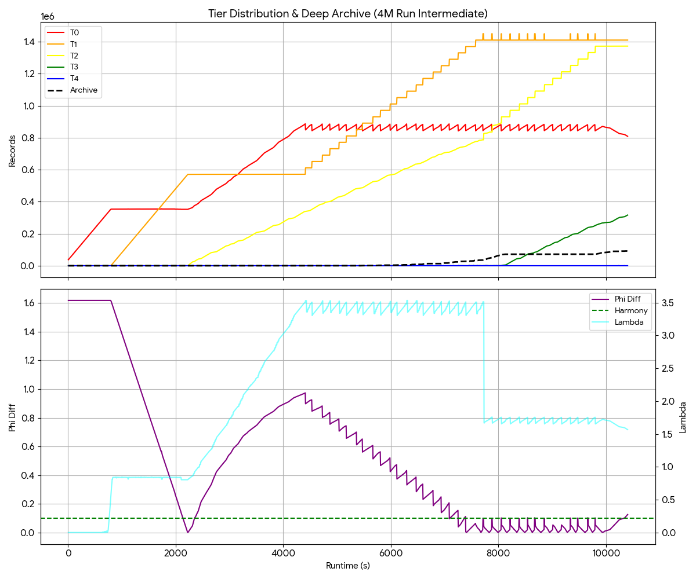
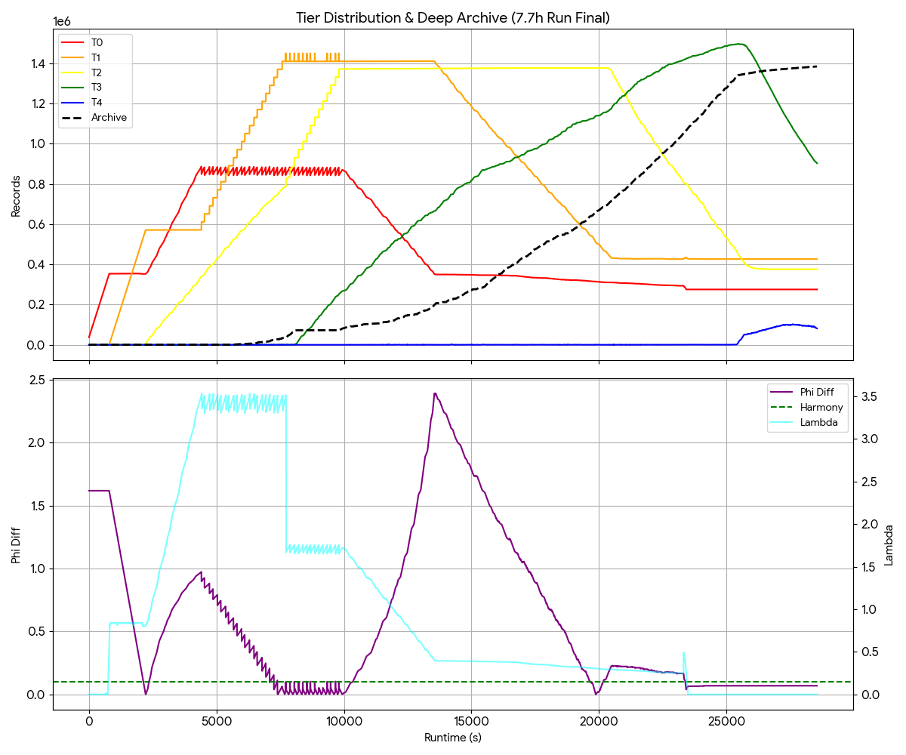
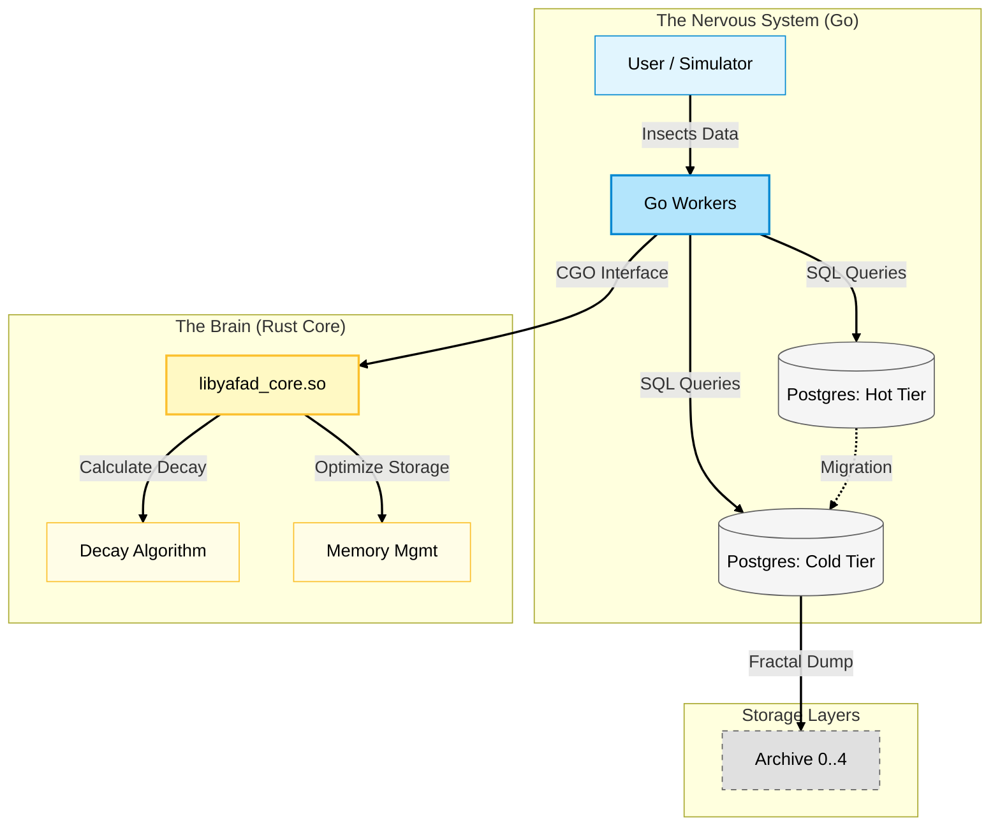

# <p align="center"></p>

**YaFaD_ai** (Yet another Fast Data access) is a bio-inspired, high-performance middleware designed to redefine data management. Instead of treating data as static entries, YaFaD treats it as **dynamic memory**, using biological principles to predictively accelerate access and optimize infrastructure costs.

---

## 🚀 What's New in v0.8.0: "The Time Traveler & The Oracle"

We’ve reached a massive milestone! YaFaD has evolved from a reactive script into a fully autonomous, predictive, and self-managing biological organism. Stress-tested with millions of records, v0.8.0 introduces true intelligence and dynamic scaling.

### 🔥 Epic New Features

* 🧠 **Pre-Cognition Engine (ML Cortex):** YaFaD is no longer just reactive—it's clairvoyant. The Rust-backed Cortex now uses a trained Linear Regression model ($R^2 = 0.96$) to predict T0 pressure spikes **30 seconds into the future**. If a data tsunami is detected, the brain proactively boosts `Lambda` before the bottleneck even occurs. 
* 📐 **Autonomous Golden Geometry:** Say goodbye to manual tuning! The new Setup Wizard uses the "Archimedes Constant" to auto-calculate the perfect capacity for all tiers (T0-T4). Give it an expected data volume, and YaFaD builds a mathematically perfect pyramid with a built-in 1.2x safety headroom. T0 always runs at a relaxed ~100%.
* 🔭 **Production Auto-Scout:** In Production mode, YaFaD acts as a scout. It connects to your source database, scans the actual table size (e.g., `user_posts`), and dynamically shape-shifts its own architecture to perfectly digest that specific table.
* 🎬 **Scenario Mode & Accelerated Aging:** Testing the "Deep Archive" is now a breeze. The generator features a new `-mode scenario` flag that simulates natural data lifecycles: **Act 1 (The Flood)** injects data, followed by **Act 2 (The Lull)** where the system rests. Combined with a new, hot-reloadable `VanishThreshold` (e.g., `10m`), you can watch YaFaD flush cold data into the Deep Archive at warp speed.

**The Result:** A rock-solid, homeostatic database engine that breathes in data waves, digests them smoothly through its tiers, and permanently archives the cold "biomass"—all without breaking a sweat or needing manual intervention.

<p align="center">
  
</p>
<p align="center">
  
</p>


# 🗺️ YaFaD Evolution Roadmap

| Phase / Version | Theme | Key Features | Status |
| :--- | :--- | :--- | :--- |
| **v0.8.1** | **Resilience & Survival** 🛡️ | • Graceful Shutdown (Signal Handling)<br>• Exponential Backoff for DB connection drops<br>• Safe Startup-Waiting | 🟢 In Progress |
| **v0.8.5** | **The Strangler Fig** 🌳 | • YaFaD Smart Proxy (Query Router)<br>• Zero-Downtime Migration (Legacy -> YaFaD)<br>• Fallback-Reads to original legacy tables | 🟡 Planned |
| **v0.9.0** | **Multi-Organism** 🦠 | • Parallel migration of multiple tables<br>• Dynamic spawning of T0-T4 pyramids per table<br>• Global memory management across all instances | 🟡 Planned |
| **v1.0.0** | **Production Ready** 🚀 | • Full containerization (Docker/K8s)<br>• Prometheus/Grafana dashboard integration<br>• Certified stability & security audits | ⚪ Future |
| **v1.5.0** | **Deep Cortex (RL)** 🧠 | • Reinforcement Learning for `Lambda` control<br>• Real-time anomaly detection in data streams<br>• Predictive pre-archiving ahead of load spikes | ⚪ Future |
| **v2.0.0** | **The Cloud Nomad** ☁️ | • S3 / Glacier / Backblaze B2 integration for Deep Archive<br>• Strict separation of Compute (Hot DB) and Cold Storage | ⚪ Vision |
| **v3.0.0** | **Autonomous Broker** 💸 | • "Self-Shopping" algorithm<br>• Live scanning of cloud storage prices (AWS, Hetzner, Cloudflare)<br>• Automatic relocation of Deep Archive blocks to the cheapest provider | ⚪ Vision |
---

## Why ?

In the age of AI, traditional databases are often bottlenecked by the sheer volume of "noise"—data that is stored but rarely used. YaFaD_ai mimics the efficiency of the human brain to solve this.

### Strategic Value

* **Cost-Efficient Scaling:** Actively "forgets" trivial data to reduce hardware overhead and cloud costs.
* **Hybrid Powerhouse:** Combines **Go’s** rapid orchestration with **Rust’s** uncompromising memory safety and speed.
* **Predictive Performance:** Uses a "Pheromone Principle" to anticipate data needs, ensuring sub-millisecond latency.

---

##  Core Concepts

### 1. The Utility Index (The Pheromone Principle)
Just as ants mark paths, YaFaD assigns a **Utility Index** to every record.
* **Reinforcement:** Frequently accessed data gains "scent," moving into high-speed tiers.
* **Relevance:** Automatically prioritizes data critical to current business operations.

### 2. Golden Ratio Cascading
We utilize the **Golden Ratio ($\Phi$)** and Fibonacci structures to manage sub-tables. This allows the system to scale organically, keeping data density and access speed in perfect equilibrium.

---

##  The Logic of "Forgetfulness" (Decay)

A system is only as fast as its ability to shed dead weight. YaFaD_ai maintains peak performance by applying a mathematical decay function to data relevance. If a record isn't reinforced by activity, its importance fades—mimicking biological memory.

### The Utility Formula

$$U_{now} = U_{last} \cdot e^{-\lambda \cdot \Delta t}$$

**Parameters:**
* **$U$ (Utility Index):** The current importance score of the data record.
* **$\lambda$ (Decay Constant):** The "Administrator Factor"—tunable to your specific business requirements.
* **$\Delta t$:** The time elapsed since the last data access.

## 🛡️ The SQL Passthrough Proxy: Transparent Integration

> *"Don't rewrite your application. Just change the port."*

Integrating a decay engine into an existing application (e.g., WordPress, Django, Node.js) usually requires massive code refactoring to manually send "keep-alive" signals for every data access. **YaFaD_ai** solves this with a zero-code **SQL Passthrough Proxy**.

### How it Works: The "Sniffer"
The proxy sits between your application and the PostgreSQL database. It acts as a transparent wire, forwarding 99% of traffic (authentication, results, errors) instantly with near-zero latency.

However, it "sniffs" `SELECT` queries for organic IDs. When your application reads a record from a managed table, the proxy asynchronously injects a **"Pheromone Signal"** into the core engine.

* **Effect:** The accessed record's **Utility Index** is immediately reset to **1.0 (100%)**.
* **Result:** Frequently read data automatically fights off decay and remains in the high-speed Hot Tier.

### 🧬 The Bio-Filter: Why Whitelisting?

A biological system must distinguish between **Living Tissue** (Content) and **Bone Structure** (Infrastructure). If YaFaD treated *every* table as organic, it might eventually decide that your `admin_users` or `migrations` table is "stale" and attempt to metabolize it. **This would be catastrophic.**

To prevent auto-digestion of critical system data, the Proxy implements a strict **Bio-Filter (Whitelist)** via `yafad_proxy.json`.

* **Inorganic (Ignored):** Tables like `users`, `permissions`, `logs`, and `settings` are invisible to the decay engine. They remain static and permanent.
* **Organic (Managed):** Only content tables defined in the whitelist (e.g., `user_posts`, `comments`, `sensor_data`) are monitored for pheromones and subject to decay.

**Configuration Example (`yafad_proxy.json`):**

```json
{
  "listen_port": "6543",         // App connects here
  "target_host": "localhost:5432", // Real DB
  "bio_filter": {
    "managed_tables": [
      "table0", "table1", "table2", // Hot Tiers
      "user_uploads",               // Specific App Content
      "temp_analytics"
    ],
    "id_pattern": "rec_\\d+_\\d+"   // Regex to identify Organic IDs
  }
}
```
---

## 🧬 Feature: The Homeostatic Regulator (PID Control)

To maintain the **Golden Ratio ($\Phi \approx 1.618$)** across storage tiers regardless of input velocity, YaFaD_ai employs a biological feedback loop inspired by the endocrine system. Just as the body regulates insulin levels, our **Homeostatic Regulator** dynamically adjusts the decay constant ($\lambda$) in real-time.

### The Concept
Instead of a static decay rate, the system utilizes a **Proportional-Integral-Derivative (PID) Controller** to monitor the "health" of the data flow. It continuously measures the ratio between adjacent tiers and modulates "gravity" to prevent both starvation and overflow.

### Control Logic

**1. Configuration (Admin Parameters)**
* **Basis Lambda ($\lambda_{base}$):** The starting decay rate (e.g., `0.005`).
* **Dynamic Range:** The safe operating window for the decay factor (e.g., `0.001` to `0.05`).

**2. The Feedback Loop**
The regulator calculates the deviation (Error) from the ideal Golden Ratio for every cascade cycle:

$$Error = \frac{Count(T_{target})}{Count(T_{source})} - 1.618$$

**3. Homeostatic Response**
* **If Error > 0 (Target Overflow):** The tier below is filling too fast. The system **decreases $\lambda$** (inhibits decay) to slow down the flow.
* **If Error < 0 (Target Starvation):** The tier below is empty. The system **increases $\lambda$** (accelerates decay) to flush data downwards.

> **Result:** A self-healing infrastructure that autonomously scales its internal "pressure" to handle sudden traffic spikes or long periods of inactivity without manual intervention.

---

## 🌌 The Fractal Archive: Recursive Scaling

<p align="center">
  
</p>

True biological systems don't just "fill up"—they grow. When a brain needs more capacity, it branches new neural pathways. YaFaD_ai applies this **Fractal Logic** to data storage.

### How it Works
Instead of letting the "Cold Tier" (Table 4) become a monolithic bottleneck, YaFaD_ai treats it as a gateway. When the archive reaches critical mass, the system autonomously spawns a **Recursive Sub-System**:

1.  **The Pressure Valve:** The system monitors latency and capacity in real-time.
2.  **Fractal Branching:** "Cold" data doesn't just sit; it is migrated into a self-contained, deep-storage loop (`Archive_0` → `Archive_4`).
3.  **Time Dilation:** In these deep fractal layers, the **Decay Lambda ($\lambda$)** runs 10x slower. Data here enters a state of "suspended animation"—ultra-low cost, organized, and retrievable, without clogging the high-speed arteries of the main system.

> **Business Impact:** This architecture allows YaFaD_ai to maintain **sub-millisecond latency** on the hot tier, even while managing **Petabytes of historical data** in the background. It creates an infrastructure that is functionally infinite yet operationally lean.

---

## 🌌 Black Hole Mechanism: Entropy & The Event Horizon

> *"Ignorance (of trivial things) is bliss"*

<p align="center">
  
</p>

To maintain operational plasticity, **YaFaD_ai** mimics biological synaptic pruning. Instead of static retention policies, every data record possesses a "Will to Live" (Utility $U$) that fights against a constant, system-wide metabolic pressure ($\lambda$).

### The Mathematical Decay
Records decay exponentially over time ($\Delta t$). Once a record's utility falls below the critical **Event Horizon** ($\epsilon$), it is identified as metabolic waste.

$$U_{new} = U_{current} \cdot e^{-\lambda \Delta t} \quad \xrightarrow{\text{check}} \quad \text{if } U_{new} < \epsilon \implies \text{VAPORIZE}$$

### Estimated Lifespan ($T_{TTL}$): System Peristalsis

Unlike static retention policies (e.g., "delete after 30 days"), YaFaD_ai's retention is **homeostatic**. The system regulates the lifespan of inactive records based on its current stress level. Think of $\lambda$ as the **rate of peristalsis** (digestive movement).

$$T_{TTL} \approx \frac{9.21}{\lambda} \quad \text{(Inverse relationship)}$$

| System Load | $\lambda$ (Peristalsis) | Data Lifespan | Biological Analogy |
| :--- | :--- | :--- | :--- |
| **High Stress** 🥵 | **⬆️ Fast** | **Short** | **Rapid Digestion:** To prevent "constipation" (storage overflow), the system accelerates the metabolism. Weak memories are vaporized quickly to clear the path for new input. |
| **Relaxed** 🧘 | **⬇️ Slow** | **Long** | **Slow Absorption:** Without pressure, the system slows down. Even low-utility data is retained longer ("sedimentation"), allowing for deep retrieval of older context. |

### The Event Horizon ($\epsilon$)
Once the utility of a record slips below the critical **Horizon Threshold** ($\epsilon$), it is no longer considered biologically viable. The system triggers a phase transition:

* **Vaporize:** The record is permanently expunged from the active index.
* **Sedimentation (Optional):** In configured "Archive" modes, vaporized data is "Cast in Amber"—compressed into deep cold storage.

---


## 🏗 System Architecture

### 1. System Overview (Component Diagram)
Go manages I/O load and database connections, while the Rust Core module acts as the 'brain' for mathematical decay calculations, integrated via a high-performance CGO interface.

#### - Physical Topology
<p align="center">
  
</p>

#### - Architecture
<p align="center">
  
</p>

#### - Migration Flow
<p align="center">
  
</p>

#### - Rust/Go integration



---
## 🚦 Usage & Evaluation

YaFaD_ai includes a comprehensive test suite to evaluate the Synaptic Buffer and Golden Ratio Cascading.

### 1. Prerequisites:

```bash
set -x DB_USER your_user
set -x DB_PASSWORD your_password
set -x DB_NAME yafad_test
```
### 2. Run the Suite (4 Terminals):

Terminal 1 (Setup): ```go run setup_db.go``` (First time: preparing DB)

Terminal 2 (Seeding): ```go run main.go``` (Start Core Engine, inject Mass)

Terminal 3 (Gravity): ```go run dashboard.go``` (Start Monitoring)

Terminal 4 (Traffic): ```go run user_simulator.go``` (Simulate Usage)

Terminal 5 (Fractal): ```go run fractal_decay.go``` (Deep Storage)

---

## 🛠 Troubleshooting CGO
Rust Linking: If you see ```undefined reference```, ensure ```core/src/lib.rs``` uses ```#[no_mangle]``` and ```extern "C"```.

Shared Object: If the program fails at startup, try: ```LD_LIBRARY_PATH=./core/target/release go run decay_worker.go```.

Database: If ```seed_db.go```` fails, run ```TRUNCATE buffer_tier, table0...``` in Postgres.

---

<div align="center">
  <h3>❤️ Support the Organism</h3>
  <p>YaFaD_ai is engineered to autonomously slash cloud storage waste. If you find this bio-inspired architecture fascinating, consider supporting its continued evolution.</p>
  <a href="https://github.com/sponsors/ErikSchiegg">
    
  </a>
</div>