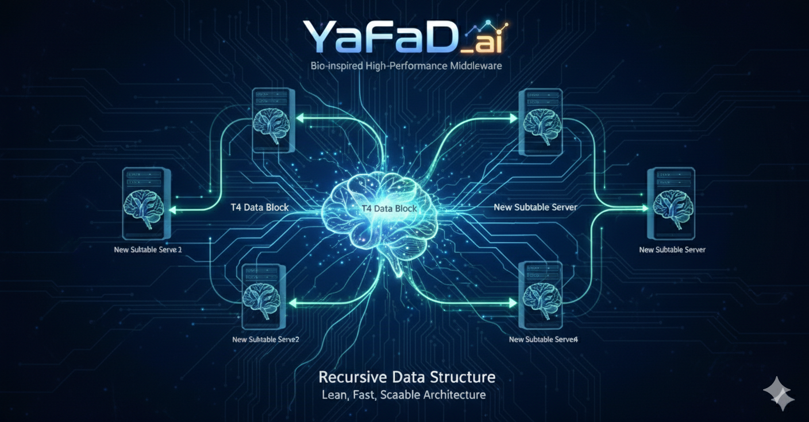
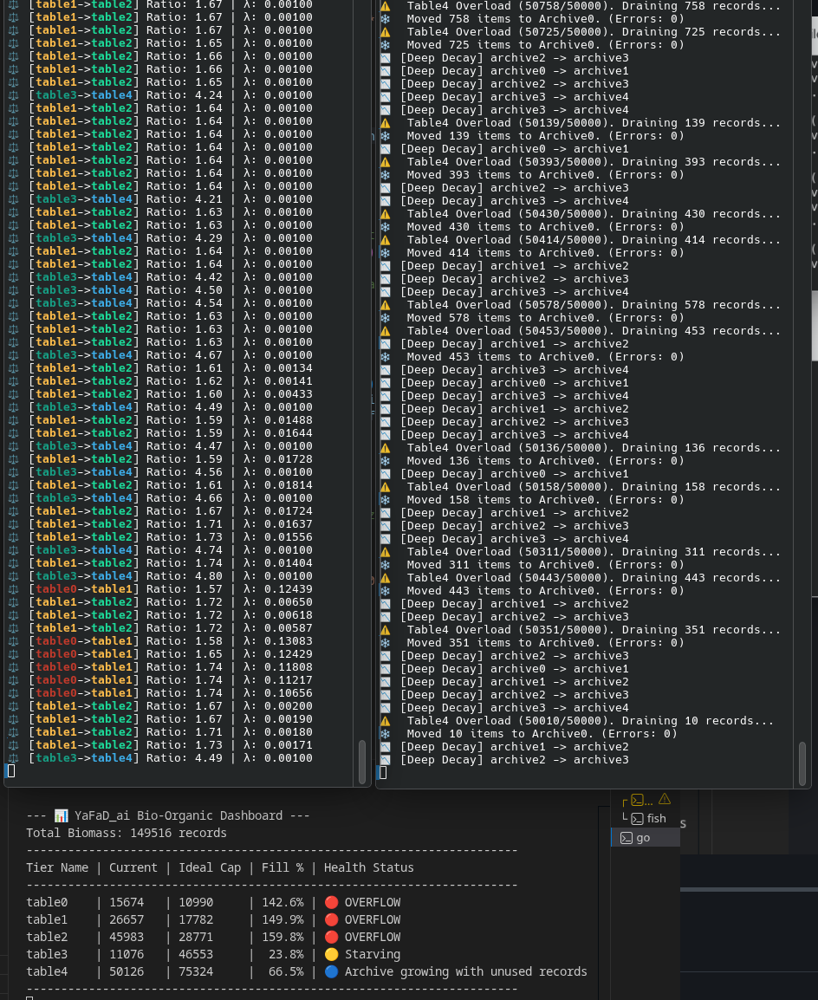
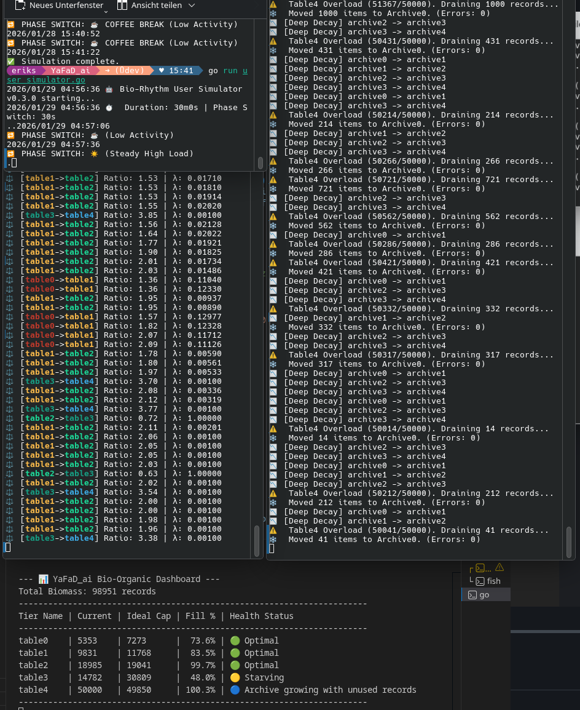
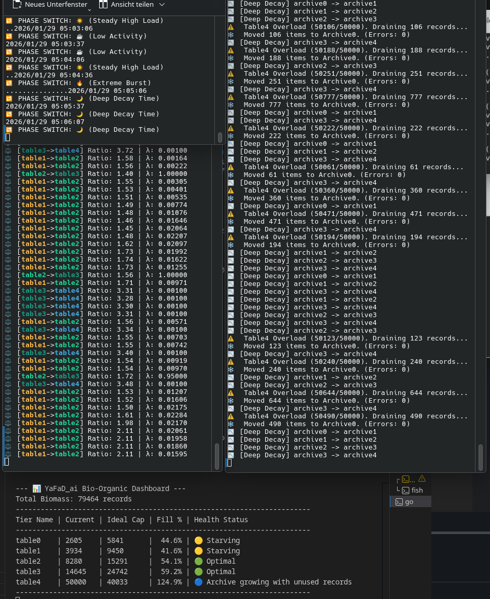
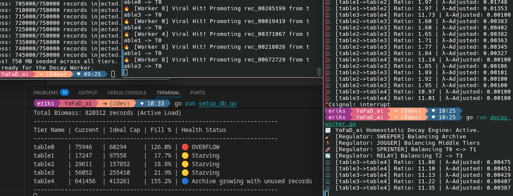
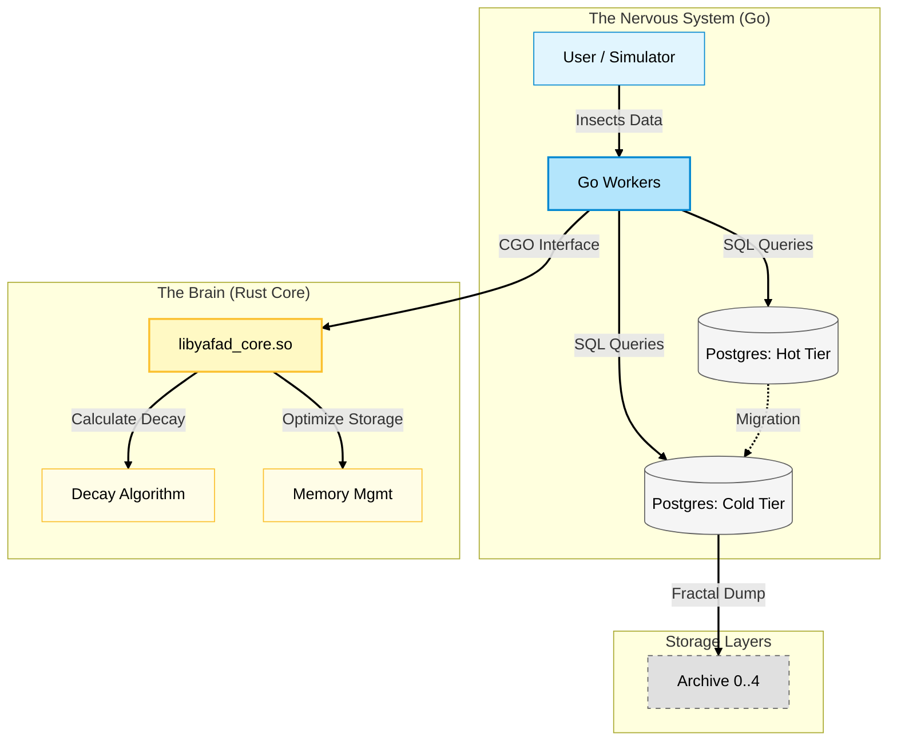
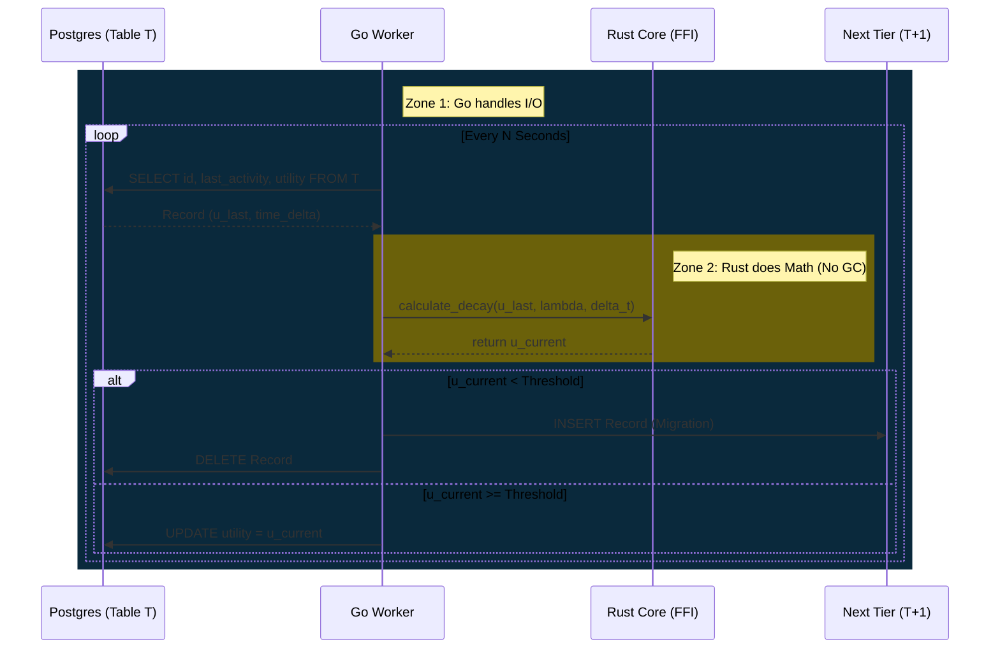

# <p align="center"></p>

**YaFaD_ai** (Yet another Fast Data access) is a bio-inspired, high-performance middleware designed to redefine data management. Instead of treating data as static entries, YaFaD treats it as **dynamic memory**, using biological principles to predictively accelerate access and optimize infrastructure costs.

---

[See our latest gigabyte stress test results and conclusions 📉](#test031) 

---

## Why ?

In the age of AI, traditional databases are often bottlenecked by the sheer volume of "noise"—data that is stored but rarely used. YaFaD_ai mimics the efficiency of the human brain to solve this.

### Strategic Value

* **Cost-Efficient Scaling:** Actively "forgets" trivial data to reduce hardware overhead and cloud costs.
* **Hybrid Powerhouse:** Combines **Go’s** rapid orchestration with **Rust’s** uncompromising memory safety and speed.
* **Predictive Performance:** Uses a "Pheromone Principle" to anticipate data needs, ensuring sub-millisecond latency.

---

##  Core Concepts

### 1. The Utility Index (The Pheromone Principle)

Just as ants mark paths, YaFaD assigns a **Utility Index** to every record.

* **Reinforcement:** Frequently accessed data gains "scent," moving into high-speed tiers.
* **Relevance:** Automatically prioritizes data critical to current business operations.

### 2. Golden Ratio Cascading

We utilize the **Golden Ratio $\Phi$** and Fibonacci structures to manage sub-tables. This allows the system to scale organically, keeping data density and access speed in perfect equilibrium.

---

##  The Logic of "Forgetfulness" (Decay)

A system is only as fast as its ability to shed dead weight. YaFaD_ai maintains peak performance by applying a mathematical decay function to data relevance. If a record isn't reinforced by activity, its importance fades—mimicking biological memory.

### The Utility Formula

$$U_{now} = U_{last} \cdot e^{-\lambda \cdot \Delta t}$$

**Parameters:**
* **$U$ (Utility Index):** The current importance score of the data record.
* **$\lambda$ (Decay Constant):** The "Administrator Factor"—tunable to your specific business requirements.
* **$\Delta t$:** The time elapsed since the last data access.

---

## 🧬 Feature: The Homeostatic Regulator (PID Control)

To maintain the **Golden Ratio ($\Phi \approx 1.618$)** across storage tiers regardless of input velocity, YaFaD_ai employs a biological feedback loop inspired by the endocrine system. Just as the body regulates insulin levels, our **Homeostatic Regulator** dynamically adjusts the decay constant ($\lambda$) in real-time.

### The Concept
Instead of a static decay rate, the system utilizes a **Proportional-Integral-Derivative (PID) Controller** to monitor the "health" of the data flow. It continuously measures the ratio between adjacent tiers and modulates "gravity" to prevent both starvation and overflow.

### Control Logic

**1. Configuration (Admin Parameters)**
* **Basis Lambda ($\lambda_{base}$):** The starting decay rate (e.g., `0.005`).
* **Dynamic Range:** The safe operating window for the decay factor (e.g., `0.001` to `0.05`).

**2. The Feedback Loop**
The regulator calculates the deviation (Error) from the ideal Golden Ratio for every cascade cycle:

$$Error = \frac{Count(T_{target})}{Count(T_{source})} - 1.618$$

**3. Homeostatic Response**
* **If Error > 0 (Target Overflow):** The tier below is filling too fast. The system **decreases $\lambda$** (inhibits decay) to slow down the flow.
* **If Error < 0 (Target Starvation):** The tier below is empty. The system **increases $\lambda$** (accelerates decay) to flush data downwards.

> **Result:** A self-healing infrastructure that autonomously scales its internal "pressure" to handle sudden traffic spikes or long periods of inactivity without manual intervention.

---
## 🌌 The Fractal Archive: Recursive Scaling

<p align="center">
  
</p>

True biological systems don't just "fill up"—they grow. When a brain needs more capacity, it branches new neural pathways. YaFaD_ai applies this **Fractal Logic** to data storage.

### How it Works
Instead of letting the "Cold Tier" (Table 4) become a monolithic bottleneck, YaFaD_ai treats it as a gateway. When the archive reaches critical mass, the system autonomously spawns a **Recursive Sub-System**:

1.  **The Pressure Valve:** The system monitors latency and capacity in real-time.
2.  **Fractal Branching:** "Cold" data doesn't just sit; it is migrated into a self-contained, deep-storage loop (`Archive_0` → `Archive_4`).
3.  **Time Dilation:** In these deep fractal layers, the **Decay Lambda ($\lambda$)** runs 10x slower. Data here enters a state of "suspended animation"—ultra-low cost, organized, and retrievable, without clogging the high-speed arteries of the main system.

> **Business Impact:** This architecture allows YaFaD_ai to maintain **sub-millisecond latency** on the hot tier, even while managing **Petabytes of historical data** in the background. It creates an infrastructure that is functionally infinite yet operationally lean.

---
## 🌌 Black Hole Mechanism: Entropy & The Event Horizon

> *"Ignorance (of trivial things) is bliss"*

<p align="center">
  
</p>

To maintain operational plasticity, **YaFaD_ai** mimics biological synaptic pruning. Instead of static retention policies, every data record possesses a "Will to Live" (Utility $U$) that fights against a constant, system-wide metabolic pressure ($\lambda$).

### The Mathematical Decay
Records decay exponentially over time ($\Delta t$). Once a record's utility falls below the critical **Event Horizon** ($\epsilon$), it is identified as metabolic waste.

$$
U_{new} = U_{current} \cdot e^{-\lambda \Delta t} \quad \xrightarrow{\text{check}} \quad \text{if } U_{new} < \epsilon \implies \text{VAPORIZE}
$$


### Estimated Lifespan ($T_{TTL}$): System Peristalsis

Unlike static retention policies (e.g., "delete after 30 days"), YaFaD_ai's retention is **homeostatic**. The system regulates the lifespan of inactive records based on its current stress level.

Think of $\lambda$ as the **rate of peristalsis** (digestive movement) in the system's tract. The controller adjusts this rate to ensure the system processes data just as fast as it ingests it.

$$
T_{TTL} \approx \frac{9.21}{\lambda} \quad \text{(Inverse relationship)}
$$

| System Load | $\lambda$ (Peristalsis) | Data Lifespan | Biological Analogy |
| :--- | :--- | :--- | :--- |
| **High Stress** 🥵 | **⬆️ Fast** | **Short** | **Rapid Digestion:** To prevent "constipation" (storage overflow), the system accelerates the metabolism. Weak memories are vaporized quickly to clear the path for new input. |
| **Relaxed** 🧘 | **⬇️ Slow** | **Long** | **Slow Absorption:** Without pressure, the system slows down. Even low-utility data is retained longer ("sedimentation"), allowing for deep retrieval of older context. |

### The Event Horizon ($\epsilon$)
Once the utility of a record slips below the critical **Horizon Threshold** ($\epsilon$), it is no longer considered biologically viable. The system triggers a phase transition:

$$
Action = \begin{cases} \text{Keep} & \text{if } U_{new} > \epsilon \\ \text{Vaporize} & \text{if } U_{new} \le \epsilon \end{cases}
$$

* **Vaporize:** The record is permanently expunged from the active index. It creates a vacuum that keeps the system lean and performant.
* **Sedimentation (Optional):** In configured "Archive" modes, vaporized data is not destroyed but "Cast in Amber"—compressed into deep cold storage (sediment) where it requires zero operational energy to maintain.

> **Operational Impact:** This mechanism ensures the database remains $O(1)$ efficient regardless of total lifespan, as the "active" population of records stabilizes naturally according to the usage pressure.
---

## 🛠 Project Status & Roadmap

| Component | Status | Tech Stack |
| :--- | :--- | :--- |
| **High-Performance Core** | ✅ Stable | Rust |
| **Orchestration Layer** | 🚧 In Progress | Go |
| **Utility-Driven Cache** | ✅ Functional | AI Logic |
| **Decay Engine (Gravity)** | ✅ Functional | Rust/Go |
| **Distributed Sync** | 📅 Roadmap | Cloud-Native |

---

❤️ Drive the future of cost-efficient infrastructure. YaFaD_ai is engineered to autonomously slash cloud storage waste and reduce operational overhead. Support the project to accelerate the development of features that directly optimize your Total Cost of Ownership (TCO). If you find the bio-inspired architecture of YaFaD_ai fascinating, consider supporting the continued evolution of this digital organism.

<a href="https://github.com/sponsors/ErikSchiegg">  </a>

---

## <a name="test031"></a> 🧬 Test Report v0.3.1: Metabolic Efficiency & Starvation Dynamics

**Date:** January 29, 2026
**Version:** v0.3.1
**Subject:** 1024MB Stress Test & Bio-Rhythmic Load Simulation

## 1. Executive Summary

Release v0.3.1 introduces a **Quadratic PID Controller** ("Turbo Boost") and an adaptive batching mechanism to handle high-velocity data ingestion. The system was subjected to a **1GB saturation test** followed by a dynamic user simulation.
**Result:** The system demonstrated exceptional stability and processing speed. It successfully resolved massive overflows but currently exhibits **"Metabolic Hyperactivity"**—processing data so efficiently that high-performance tiers become underutilized ("Starving") during low-traffic phases.

## 2. Test Protocol & Observations

### Phase A: Saturation (The Flood)

* **Scenario:** Injection of 1,024,000 records (approx. 1GB) into a cold system.
* **Observation:**
* All active tiers (T0–T3) reached and exceeded their ideal capacity (>100% Fill).
* **Status:** `🔴 OVERFLOW`.
* **System Response:** The Decay Engine remained stable. No memory leaks or deadlocks occurred during the saturation phase.
<p align="center">
  
</p>


### Phase B: Dynamic Simulation (The Metabolism)

* **Scenario:** Activation of the `user_simulator` v0.3.0, cycling through four load phases: *Morning Rush*, *Coffee Break*, *Viral Spike*, and *Night Mode*.
* **Observation:**
* **Turbo Boost Activation:** Upon detecting the initial overflow (e.g., T2 at >300%), the new PID logic triggered high  values (Decay Rates) and increased batch sizes (up to 20k records).
* **Rapid Clearing:** The backlog in Tier 2 was processed and migrated downwards within minutes.
<p align="center">
  
</p>


### Phase C: Equilibrium & Starvation (Current State)

* **Scenario:** Prolonged "Night Mode" (Low/Zero Activity) after the backlog was cleared.
* **Observation:**
* **Tiers T0, T1, T2:** Fill levels dropped significantly below the target  ratio, reaching ~35-50% capacity.
* **Status:** `🟡 STARVING`.
* **Tier T4 (Archive):** Continues to grow (>120%), confirming that data is being preserved in deep storage rather than lost.
<p align="center">
  
</p>


## 3. Technical Diagnosis

The system is currently **hyper-metabolic**.
The **Quadratic PID Controller** is highly effective at reducing stress (handling Overflow) but lacks a symmetrical "Conservation Mode." When input pressure drops, the decay rate () does not decelerate fast enough to retain data in the Hot Tiers. The system effectively "digests" the data faster than the simulation can feed it during quiet periods.

## 4. Conclusion & Roadmap to v0.4.0

**Verdict:** SUCCESS. The primary goal of v0.3.1 (handling massive load and preventing constipation) was achieved. The system is robust and capable of handling loads far exceeding 1GB.

**Next Steps (v0.4.0):**

1. **Implement Conservation Circuit:** Invert the PID logic to force  (Hibernation) when a tier drops below 50% capacity. This will maintain "warmth" in the cache during Night Mode.
2. **Recall Mechanism:** Implement a "Viral Recall" feature to promote archived data back to Hot Tiers upon access.

---

## 🧪 Evaluation & Benchmarking

YaFaD_ai includes a comprehensive test suite to evaluate the **Synaptic Buffer** and **Golden Ratio Cascading** logic (Development Roadmap).

### 1. Prerequisites

Set your environment variables for PostgreSQL communication:

```bash
set -x DB_USER your_user
set -x DB_PASSWORD your_password
set -x DB_NAME yafad_test

```

## 🚦 Dashboard & Health Status (v0.3.1)

The system now utilizes a color-coded health monitoring system:

* **🔴 OVERFLOW (>150%):** The tier is under extreme pressure. The **Quadratic PID** will engage "Turbo Mode" (High $\lambda$, Large Batches) to flush data downwards.
* **🟢 OPTIMAL (80-120%):** The Golden Ratio ($\phi$) is maintained. The system is in homeostasis.
* **🟡 STARVING (<50%):** The system processes data faster than it ingests it. Decay slows down, but in v0.3.1, high-performance tiers may empty out during "Night Mode".
* **🔵 ARCHIVE GROWING:** This is the expected end-state. T4 and Deep Archives accumulate the "Sediment" of processed data.

**Current Performance Characteristic:**
YaFaD v0.3.1 is **hyper-metabolic**. Expect rapid clearing of hot tables during low-traffic phases.

### 2. 🚀 Running the Evaluation

Navigate to the project folder and open **four** terminal windows:

1. **Terminal 1 (Monitor):** Start the core engine and dashboard.
```bash
go run setup_db.go

```


2. **Terminal 2 (Seeding):** Create the evaluation data mass (e.g., 90MB).
```bash
go run seed_db.go

```


3. **Terminal 3 (Gravity):** Start the biological decay worker to trigger the Golden Ratio cascade.
```bash
go run decay_worker.go

```


4. **Terminal 4 (Traffic):** Emulate user behavior and data reinforcement.
```bash
go run user_simulator.go

```


5.  **Terminal 5 (Fractal Engine):** Activate the recursive deep-storage system.
```bash
go run fractal_decay.go
```
*Note: This worker acts as the "Pressure Valve." It monitors `table4` for overflows (>50k records) and autonomously manages the infinite archive cascade (`archive0` → `archive4`).*

<p align="center"></p>

---
# YaFaD_ai System Architecture

## 1. System Overview (Component Diagram)

This diagram illustrates the hybrid architecture. Go manages I/O load and database connections, while the Rust Core module acts as the 'brain' for mathematical decay calculations, integrated via a high-performance CGO interface.



## 2. Data Lifecycle (Sequence Diagram)

The record lifecycle demonstrates a strict separation of concerns: The Go worker retrieves data, passes raw numerical values to Rust for computation, and executes database operations based on the results. This ensures the Go Garbage Collector remains unburdened by heavy math.



## 3. The Fractal Conveyor Belt (State Diagram)

The core of v0.2.0: Data flows from Hot Tiers (Memory/SSD) into the 'Cold Gateway'. Upon overflow (>50k records), data is offloaded into the fractal archive (HDD/Tape), where time (Lambda λ) is dilated by a factor of 10.

```mermaid
stateDiagram-v2
    direction LR

    state "Hot Storage (Mem/SSD)" as Hot {
        [*] --> Table0
        Table0 --> Table1: Fast Decay
        Table1 --> Table2: Medium Decay
    }

    state "Cold Gateway" as Gateway {
        Table2 --> Table3: Archive Buffer
        Table3 --> Table4: The Monster
        note right of Table4
            Limit: 50k Records
            "Pressure Valve"
        end note
    }

    state "Fractal Archive (HDD/Tape)" as Fractal {
        Table4 --> Archive0: Overflow
        Archive0 --> Archive1: λ * 0.1
        Archive1 --> Archive2: λ * 0.01
        Archive2 --> Archive3: λ * 0.001
        Archive3 --> Archive4: Deep Freeze
    }

    %% --- STYLING (Muss zwingend ausserhalb der Klammern stehen!) ---
    
    %% Gruppen-Farben
    style Hot fill:#b3e5fc,stroke:#0288d1,color:black
    style Gateway fill:#ffe0b2,stroke:#f57c00,color:black
    style Fractal fill:#e0e0e0,stroke:#616161,color:black

    %% Tabellen-Farben (Weiß mit Rand)
    style Table0 fill:white,stroke:#0288d1,color:black
    style Table1 fill:white,stroke:#0288d1,color:black
    style Table2 fill:white,stroke:#0288d1,color:black
    
    style Table3 fill:white,stroke:#f57c00,color:black
    style Table4 fill:white,stroke:#f57c00,color:black
    
    style Archive0 fill:white,stroke:#616161,color:black
    style Archive1 fill:white,stroke:#616161,color:black
    style Archive2 fill:white,stroke:#616161,color:black
    style Archive3 fill:white,stroke:#616161,color:black
    style Archive4 fill:white,stroke:#616161,color:black
```


---

## 🛠 Troubleshooting & CGO Setup

Building a Go/Rust hybrid requires tight coordination. Here are solutions to common hurdles:

### 1. The Rust-Go Bridge (Linking)

If you see `undefined reference to 'calculate_decay'`:

* **No Mangle:** Ensure `core/src/lib.rs` uses `#[no_mangle]` and `pub extern "C"`.
* **Library Type:** `core/Cargo.toml` must have `crate-type = ["cdylib", "staticlib"]`.
* **Force Rebuild:** Run `cd core && cargo clean && cargo build --release`.

### 2. Shared Library Path

If the program fails at startup (`cannot open shared object file`):

* **RPATH:** We use `-Wl,-rpath` in Go `LDFLAGS` to bake the path into the binary.
* **Manual Override:** `LD_LIBRARY_PATH=./core/target/release go run decay_worker.go`.

### 3. Database Integrity

* **Unique Constraints:** If `seed_db.go` fails, run:
`TRUNCATE buffer_tier, table0, table1, table2, table3, table4;`
* **CGO Cache:** If linking still fails after a fix, run `go clean -cache`.

---


