# <p align="center"></p>

**YaFaD_ai** (Yet another Fast Data access) is a bio-inspired, high-performance middleware designed to redefine data management. It treats data as a **living organism** that breathes, metabolizes, and evolves. By utilizing biological principles like the **Golden Ratio ($\Phi$), Pheromone Signaling,** and **Synaptic Pruning,** YaFaD autonomously optimizes data access and infrastructure costs.

---

# 🚀 Release: YaFaD_ai v0.9.5 – The "Semantic Fractal" Update

We are thrilled to announce **YaFaD_ai v0.9.5**. With this release, the engine officially graduates from a simulated concept to a **production-ready, self-organizing data architecture**. 

YaFaD is no longer just moving data based on time and decay; it now understands the *meaning* of your data, absorbs massive enterprise migrations without breaking a sweat, and manages infinite data depths with precision physics.

Here is what makes v0.9.5 our biggest leap forward yet:

### 🧠 1. Local-First Semantic Memory (pgvector + Ollama)
YaFaD now features a fully integrated Vector Brain. We’ve upgraded the database schema with `pgvector` and ultra-fast **HNSW indices**. 
* **Lazy Harvester:** A new, silent background worker grabs fresh, unvectorized data and passes it to a local AI model (e.g., Ollama running `nomic-embed-text`).
* **Zero-Blocking Architecture:** "Insert first, embed later." YaFaD processes 10,000+ inserts per second while vectorizing payloads asynchronously in the background. 
* **100% Privacy:** Complete semantic understanding running entirely on local hardware. No API costs, no data leaks.

### 🐘 2. The "Elephant in the Boa" (Hot Migration Shock Absorber)
Running a live enterprise migration of millions of records usually destroys database performance. Not anymore. 
* **T4 as an Elastic Buffer:** Tier 4 now acts as a massive shock absorber. During heavy injections, it expands up to 150% of its golden ratio capacity to swallow the pressure wave.
* **T0-T3 Equilibrium:** While T4 temporarily digests the mass, T0 to T3 remain perfectly balanced, ensuring that live user queries stay lightning fast. The system automatically self-heals and drains the excess into the deep archive organically.

### 🎛️ 3. PID-Controlled Fractal Engine
The descent into the infinite `archiveN` tiers is no longer a hard cutoff. 
We implemented a genuine **PID Controller** that monitors the pressure between `table4` and `deep_archive`. It dynamically adjusts the decay rate ($\lambda$), ensuring a smooth, fluid transition of data into the deeper fractal layers based on real-time system load.

### 💨 4. Dynamic Hawking Radiation (Epsilon)
The event horizon is now fully in your control. The `EPSILON` threshold—the exact mathematical point where entirely dead data evaporates from the deep fractal to reclaim disk space—can now be adjusted live via the Mission Control Dashboard without restarting the engine.

### 🎛️ 5. Live-Tuning Mission Control
The Gradio Dashboard has received a massive upgrade for live operations:
* **Live Physics:** Adjust CPU limits, PID settings, and T0 capacities on the fly via sliders. The engine adapts instantly without requiring an "Ignition" restart.
* **Unified Telemetry:** The Fractal Engine's deep decay logs are now directly streamed into the dashboard UI, giving you real-time visibility into gravity falls and Hawking radiation alongside your live Prometheus metrics.

---

**Status:** `PRODUCTION READY` 🟢
YaFaD v0.9.5 proves that an organic, physics-based approach to data lifecycle management isn't just theory—it handles 5-million-record hot migrations gracefully while quietly building a semantic vector map of your entire universe.

*Next up in the pipeline: Contextual Querying & Anti-Gravity (Buoyancy) – bringing cold, relevant data back to the surface before the user even asks for it!* 🌌🐘🐍

---

## 🛠️ Mission Control: Docker Commands

Ollama is presumed to be installed, alredy, and not included in the Yafad_ai Docker container.

To pull the 768 vevtor embedding model into your preinstalled Docker Ollama:

```bash
docker exec -it yafad_ollama ollama pull nomic-embed-text
```

Getting YaFaD up and running is now a one-liner.

### 🚀 Start the Organism
Build the images and start all services (Engine, DB, Dashboard, Grafana) in the background:
```bash
docker-compose up --build -d
```

## 📊 Monitor the Pulse

Follow the engine logs in real-time to watch the "Biomass" grow:
```bash
docker logs -f yafad-engine-1
```

## ⏸️ Pause / Stop the Mission

Shut down all containers while keeping your data intact in the volumes:
```bash
docker-compose down
```

## 🧹 Total Reset (Clean Slate)

Wipe the database and start a completely fresh test run:
```bash
docker-compose down -v
docker-compose up --build
```
---

### 🌐 Connectivity Map

| Service | URL | Note |
| --- | --- | --- |
| **Gradio Dashboard** | `http://localhost:7888` | Main UI |
| **Grafana** | `http://localhost:3031` | User/Pass: admin |
| **Prometheus Metrics** | `http://localhost:2112/metrics` | Raw Data |
| **Internal Profiling** | `http://localhost:6060/debug/pprof` | Debugging |

---

**YaFaD v0.9.4** is not just a tool; it's a living, breathing data architecture. Secure, scalable, and finally—easy to install.

**Ready to ignite? 🧪🦁**

---

👉 Access via browser: ```http://localhost:7888```
<p align="center">
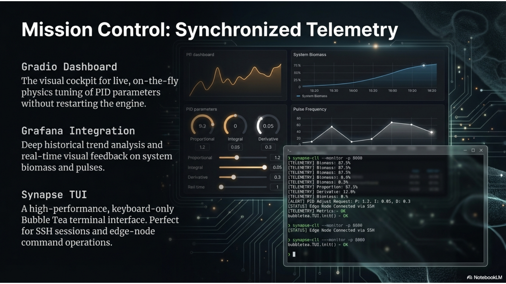
</p>

---

## 🛠️ System Requirements & Prerequisites

**1. Docker & Docker Compose**
YaFaD v0.9.4 is fully containerized. You only need Docker installed on your host system. 
All environment variables and library paths are pre-configured within the containers.

## ⚙️ Customizing Your Metabolism: `docker-compose.yml` Guide

YaFaD v0.9.4 allows you to tune the "biological" behavior of the organism directly through the orchestration layer. Below is the guide on how to modify the environment and resource allocation.

### 1. Database Connectivity & Credentials

If you want to change the database user or password, you must update them in **three** places within the `services` section to ensure the ecosystem remains synchronized.

```yaml
# Update these in 'postgres', 'yafad-engine', and 'dashboard'
environment:
  - POSTGRES_USER=eriks      # The master user
  - POSTGRES_PASSWORD=test   # The master password
  - DB_HOST=localhost        # Keep as localhost when using network_mode: host

```

### 2. Tuning Resource Throttle

YaFaD is designed to be high-performance but respectful of your host system. You can limit the CPU impact of the injection and background workers:

* **Edit `yafad-engine` environment:**
* `MAX_CPU_PERCENT`: Sets the upper limit for Go routine scheduling.
* *Example:* Set to `80` for high-speed ingestion or `30` for background "quiet" operation.


### 3. TUI & Dashboard Port Mapping

By default, YaFaD uses `network_mode: host` for maximum performance on Linux (EndeavourOS/Arch). If you need to change the ports because of conflicts, modify the following:

| Service | Setting to Change | Default |
| --- | --- | --- |
| **Grafana** | `GF_SERVER_HTTP_PORT` | `3031` |
| **Dashboard** | `GRADIO_SERVER_PORT` | `7888` |
| **Metrics** | Engine internal | `2112` |

### 4. Persistence & Shared Workspace

YaFaD uses **Docker Volumes** to ensure your "Brain Weights" and "Migration Policies" survive a container restart.

* **`pgdata`**: Stores the actual PostgreSQL database files.
* **`shared_workspace`**: This is the "inter-process" memory. It contains:
* `yafad_config.json` (Live system state)
* `brain_weights.json` (The neural network weights)
* `yafad_metrics.csv` (The pulse data for Grafana)


> [!TIP]
> To reset the entire system including all learned brain weights and database records, run:
> `docker-compose down -v`

---

## 🛠️ Step-by-Step: Applying Changes

1. **Open the file:**
`nano docker-compose.yml`
2. **Modify the variables:**
Change the `environment` values as needed.
3. **Restart the Organism:**
Since environment variables are injected at startup, you need to recreate the containers:
```bash
docker-compose up -d

```


*(Note: `--build` is only required if you changed the Dockerfile or the Go/Python source code.)*

---

## 🧠 How YaFaD Works: Visual Deep Dive
The following concepts represent the **Autonomous Data Metabolism** of YaFaD_ai.

**1. The Metabolism of Relevance**
YaFaD does not store data; it metabolizes it. Every record has a "Utility Index" **($U$)** that acts as its life force.
<p align="center">
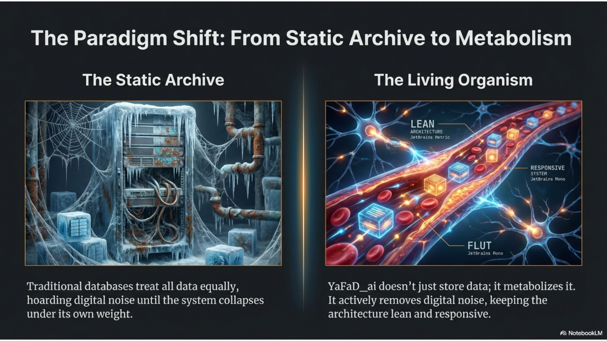
</p>
<p align="center"><i>Fig 1: The Bio-Inspired Flow of Information</i></p>

**2. The Golden Ratio Cascade ($\Phi$)**
Data flows through tiers (T0 to T4) based on the **Golden Ratio (1.618)**. This mathematical constant ensures that as data ages, it moves into exponentially larger, slower, and cheaper tiers.
<p align="center">
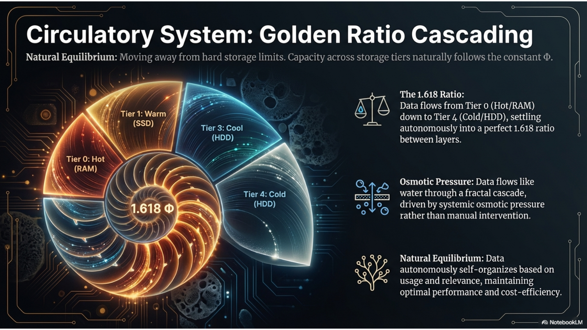
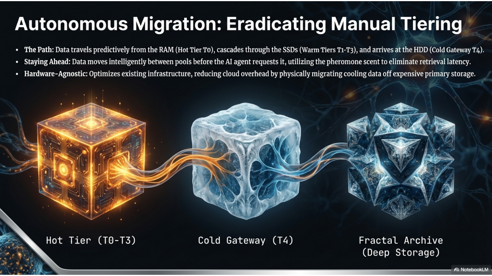
</p>
<p align="center"><i>Fig 2: Mathematical Equilibrium and Tiering Logic</i></p>

**3. The Pheromone Principle (Access Acceleration)**
Whenever a user accesses a record, the **SQL Passthrough Proxy** injects a "Pheromone Signal." This resets the record's Utility to 1.0, pulling it back from the "Cold Tiers" into the "Hot Tiers."

<p align="center">

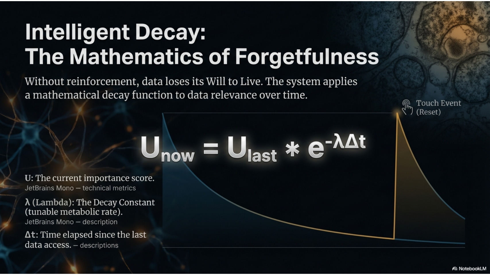
</p>

---
## 🏗️ System Architecture

**Physical Topology**
YaFaD acts as a high-performance shield between your Application and your Database.

<p align="center">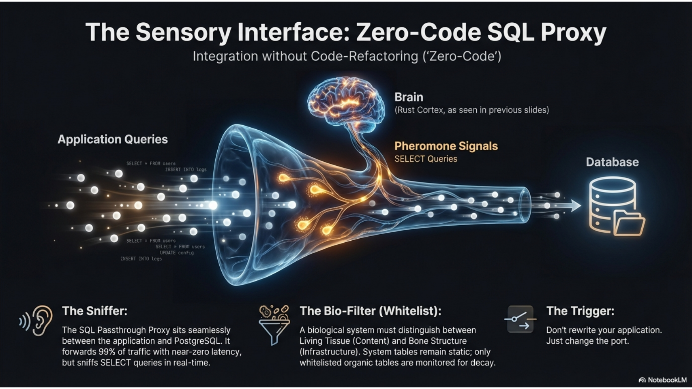</p>

**UML & Component Interaction**
The Go-Side handles the "Nervous System" (I/O, Networking), while the Rust-Side handles the "Cerebral Cortex" (Mathematical Decay).

<p align="center">

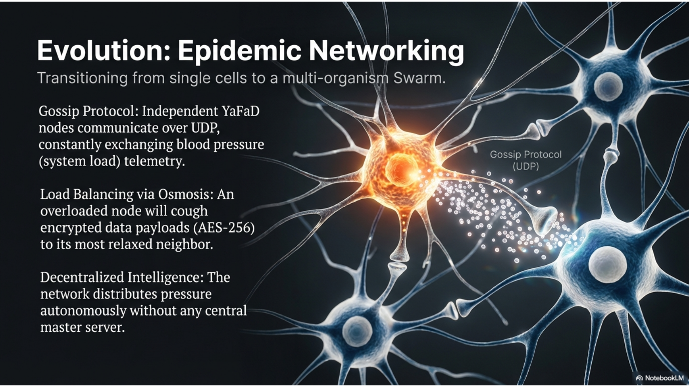
</p>

**The Strangler Fig Migration Flow**
In v0.9.3, the migration is **Homeostatic.** The system monitors the T0 pressure and "breathes in" data from the legacy source only when there is space.

<p align="center">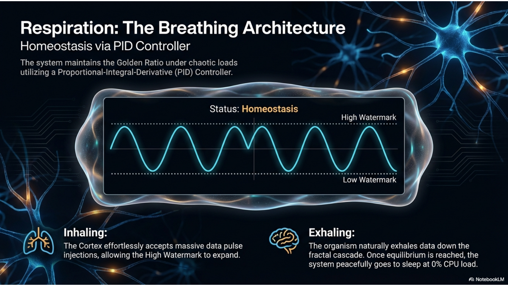</p>

---

## 🚦 Operational Modes

### 🧪 Simulation Mode
Used for stress-testing and calibration. Generates millions of synthetic records to see how the Golden Ratio holds under load.

### 🌿 Legacy Migration (Strangler Fig)
1. Safe Read: The proxy reads the old database with offsets.

2. Nuke Option (Optional): Once a table is 100% migrated, the dashboard can trigger a TRUNCATE on the source table to free up disk space immediately.

### 🧠 Expert Tuning
Using the PID Controller (Proportional-Integral-Derivative), you can tune how "aggressive" the system is in forgetting data.

* **High Watermark:** Stop ingestion when T0 is full.
* **Low Watermark:** Resume ingestion when T0 has "digested" the data into T1.
---

## 🛠 Troubleshooting
* **Shared Object Error:** If Go can't find the Rust core, ensure ```LD_LIBRARY_PATH``` points to ```./core/target/release```.

* **Port 7888 Blocked:** If the dashboard fails to start, run ```fuser -k 7888/tcp``` to kill the previous session.

* **Database Constipation:** If T0 doesn't decrease, check if ```main.go``` is actually running or if the ```max_cpu_percent``` is set too low.
---

### 🎥 Watch the Explainer Videos

**🇺🇸🇬🇧 English Version:** (right-click to open in new tab)

<a href="https://www.youtube.com/watch?v=pBhPLxvwYpE">
  
</a>
<br>

**🇩🇪 Deutsche Version:**

<a href="https://www.youtube.com/watch?v=EAv0NE9jy7E">
  
</a>

---

## 🚀 YaFaD_ai v0.9.3 is Live: The "True Osmosis" Update! 🧬
I am incredibly excited to announce the release of **YaFaD_ai v0.9.3**! We've pushed the bio-inspired architecture to a whole new level, completely transforming how the system ingests and metabolizes massive datasets from legacy databases.

If you've ever worried about crashing your servers, blowing up your RAM, or locking your database during a multi-million record migration, this update is for you. YaFaD now handles it autonomously.

### 🌳 The Smart "Strangler Fig" Migration**
We've overhauled the legacy migration proxy. Instead of blindly injecting fixed data chunks, YaFaD now features Homeostatic Ingestion:

* **Dynamic Pressure Calculation:** The proxy reads the exact "T0 Pressure" in real-time and calculates the precise delta needed to hit the optimal **150% capacity peak**. It "breathes" data in perfectly even, mathematically calculated waves.

* **Safe Read Mode:** Zero risk to your legacy DB. YaFaD safely siphons data using high-speed offset reads, completely preventing PostgreSQL WAL (Write-Ahead Log) bloat.

* **Auto-Nuke (Optional):** Once a legacy table is 100% absorbed and safely cascading through the tiers, YaFaD can automatically ```TRUNCATE``` the old table to instantly free up disk space.

### 🎛️ Mission Control Supercharged
The Gradio-based web dashboard has received massive tactical upgrades:

* **⚡ In-Flight CPU Tuning:** Adjust the engine's maximum CPU limit dynamically on the fly—no engine restarts required!

* **⏸️ Global Pause/Resume:** Instantly hold all simulation and migration processes with a single click.

* **💾 Real-Time Anatomy:** Track the live disk/RAM size of every single tier (T0-T4) directly in the UI to calibrate your estimations perfectly.

* **☢️ Nuclear Flush:** A hardened DB wipe that utilizes OS-level zombie-process eradication (pkill) to guarantee a 100% pristine state for new runs.

Data migration just became organic, mathematically perfect, and entirely crash-proof. 🌊📉

---

### The Result:
A self-regulating, breathing, and hardware-aware data organism. It doesn't just store data; it metabolizes it. With the new "Pulse" mechanics and visual feedback in Grafana, YaFaD v0.9.0 is ready for the main stage. 🦁📊

---
## In the ressource saving, runs everywhere 🦁 Synapse TUI (Command Terminal)

Synapse is a high-performance, "Bubble Tea" powered terminal interface for monitoring and controlling the YaFaD core engine. It allows for keyboard-only interaction, perfect for SSH sessions or tiling window managers.

### ⚡ Start Procedure Synapse TUI (Command Terminal)

**1. Ignite the Core Engine** (Essential!)
Open a terminal and start the database core. This process generates the live telemetry.

```bash
go run main.go
```

**2. Launch Synapse**
Open a second terminal window and launch the commander interface.

```bash
go run synapse.go
```

<p align="center">
  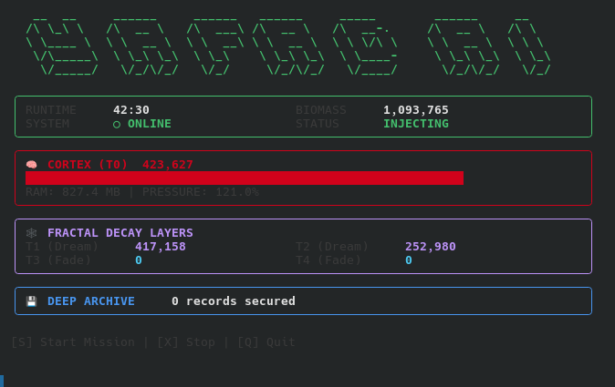
</p>

### 🔧 Troubleshooting
**"SIGNAL LOST" / Waiting for Core**

* Synapse reads telemetry from ```yafad_metrics.csv```. If ```main.go``` is not running, Synapse will display stale data or a waiting message.

* Fix: Ensure go run ```main.go``` is running in a separate terminal.

**Display Glitches**

* Ensure you use a modern terminal (Fish, Alacritty, iTerm2, Windows Terminal).

* Resize your terminal window to at least ~80 characters width.

```S``` **Start Mission:** Opens the Wizard to configure and ignite the engine.<br>
```X``` **Stop Mission:** Triggers an emergency stop (requires confirmation).<br>
```R``` **Refresh:** Force a UI refresh (Auto-refresh is active by default).<br>
```Q``` **Quit:** Exits the Synapse TUI (Engine continues running).<br>
```Esc``` **Back/Cancel:** Returns to dashboard from Wizard or cancels action.

---
## In the full scale full comfort Gradio/Grafana interface:

### 🚀 Mission Control (Web Dashboard)

The Mission Control interface provides a visual cockpit for tuning PID parameters on the fly, managing database migrations, and viewing deep historical trends via Grafana.

### 🛠️ Prerequisites

* **Anaconda / Miniconda** (Recommended for environment isolation)
* **Grafana** (Running on `localhost:3000` for chart integration)

### ⚡ Start Procedure

**1. Ignite the Core Engine** (Essential!)
The dashboard controls the engine via configuration files. The engine must be running to react to your commands.
```bash
go run main.go
```

**2. Launch the Dashboard**
Open a second terminal. We use a helper script to launch the dashboard inside the correct Python environment.
```bash
# Make script executable (Linux/Mac)
chmod +x start_dashboard.sh

# Run it
./start_dashboard.sh
```

**3. Access the Interface**
Open your web browser and navigate to:
👉 http://localhost:7888

**📊 Grafana Integration**
The dashboard embeds Grafana via an iframe.

* Default URL: http://localhost:3000/d/yafad-main.

* You can change the target URL dynamically in the ⚙️ Settings tab.

**💡 The "Full Stack" Workspace**
For the complete operations experience, run the components in three separate terminal windows:

1. Terminal A: ```go run main.go``` (The Engine)

2. Terminal B: ```go run synapse.go``` (The Commander)

3. Terminal C: ```./start_dashboard.sh``` (The Visuals)

## 🛠️ Pro Tip: Running YaFaD as a Linux Background Service (Systemd)
If you want YaFaD to survive reboots and run autonomously in the background (highly recommended for Edge/Core Nodes), you can easily set it up as a ```systemd``` service.

1. Build the engine
First, compile the Go code into a highly efficient binary:
```bash
go build -o yafad_engine main.go
```

2. Create the Service File
Create a new file at ```/etc/systemd/system/yafad.service``` (requires root privileges):
```bash
sudo nano /etc/systemd/system/yafad.service
```
Paste the following configuration (make sure to replace ```/path/to/yafad and your_username``` with your *actual* paths/user):
```Ini, TOML
[Unit]
Description=YaFaD - Biological Data Fractal Engine
After=network.target postgresql.service

[Service]
Type=simple
User=your_username
WorkingDirectory=/path/to/yafad
ExecStart=/path/to/yafad/yafad_engine
Restart=always
RestartSec=3

# Environment variables if needed
Environment="DB_USER=eriks"
Environment="DB_PASSWORD=test"

[Install]
WantedBy=multi-user.target
```
3. Enable and Start the Organism
Reload the systemd manager, enable YaFaD to start on boot, and ignite the engine:
```bash
sudo systemctl daemon-reload
sudo systemctl enable yafad      # Starts YaFaD automatically on every reboot
sudo systemctl start yafad       # Starts it right now
```
4. Check the Status & Logs
To see the live heartbeat and logs of your YaFaD node:
```bash
sudo systemctl status yafad
journalctl -u yafad -f
```
---
**Result:**

<p align="center">
  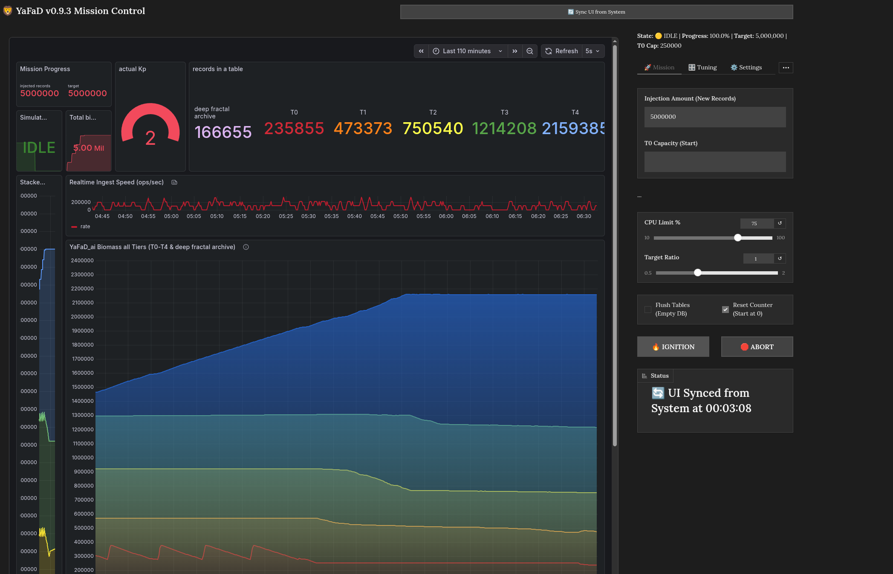
</p>

# 🗺️ YaFaD Evolution Roadmap

<p align="center">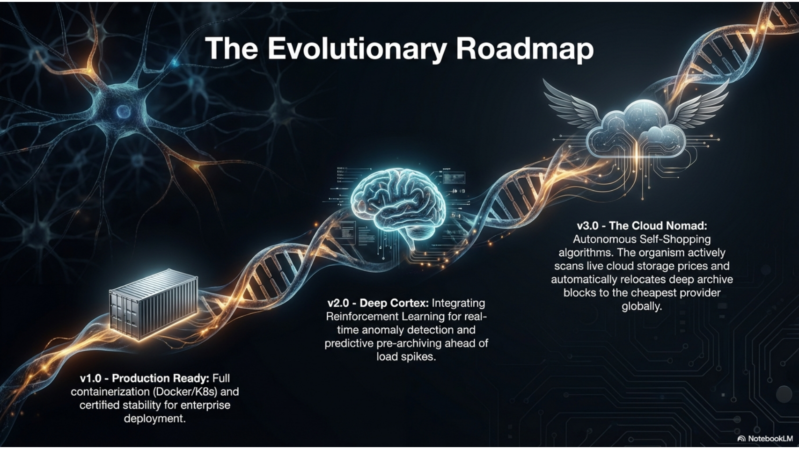</p>
---

## Why ?

In the age of AI, traditional databases are often bottlenecked by the sheer volume of "noise"—data that is stored but rarely used. YaFaD_ai mimics the efficiency of the human brain to solve this.

### Strategic Value

* **Cost-Efficient Scaling:** Actively "forgets" trivial data to reduce hardware overhead and cloud costs.
* **Hybrid Powerhouse:** Combines **Go’s** rapid orchestration with **Rust’s** uncompromising memory safety and speed.
* **Predictive Performance:** Uses a "Pheromone Principle" to anticipate data needs, ensuring sub-millisecond latency.

---

##  Core Concepts

### 1. The Utility Index (The Pheromone Principle)
Just as ants mark paths, YaFaD assigns a **Utility Index** to every record.
* **Reinforcement:** Frequently accessed data gains "scent," moving into high-speed tiers.
* **Relevance:** Automatically prioritizes data critical to current business operations.

### 2. Golden Ratio Cascading
We utilize the **Golden Ratio ($\Phi$)** and Fibonacci structures to manage sub-tables. This allows the system to scale organically, keeping data density and access speed in perfect equilibrium.

---

##  The Logic of "Forgetfulness" (Decay)

A system is only as fast as its ability to shed dead weight. YaFaD_ai maintains peak performance by applying a mathematical decay function to data relevance. If a record isn't reinforced by activity, its importance fades—mimicking biological memory.

### The Utility Formula

$$U_{now} = U_{last} \cdot e^{-\lambda \cdot \Delta t}$$

**Parameters:**
* **$U$ (Utility Index):** The current importance score of the data record.
* **$\lambda$ (Decay Constant):** The "Administrator Factor"—tunable to your specific business requirements.
* **$\Delta t$:** The time elapsed since the last data access.

## 🛡️ The SQL Passthrough Proxy: Transparent Integration

> *"Don't rewrite your application. Just change the port."*

Integrating a decay engine into an existing application (e.g., WordPress, Django, Node.js) usually requires massive code refactoring to manually send "keep-alive" signals for every data access. **YaFaD_ai** solves this with a zero-code **SQL Passthrough Proxy**.

### How it Works: The "Sniffer"
The proxy sits between your application and the PostgreSQL database. It acts as a transparent wire, forwarding 99% of traffic (authentication, results, errors) instantly with near-zero latency.

However, it "sniffs" `SELECT` queries for organic IDs. When your application reads a record from a managed table, the proxy asynchronously injects a **"Pheromone Signal"** into the core engine.

* **Effect:** The accessed record's **Utility Index** is immediately reset to **1.0 (100%)**.
* **Result:** Frequently read data automatically fights off decay and remains in the high-speed Hot Tier.

### 🧬 The Bio-Filter: Why Whitelisting?

A biological system must distinguish between **Living Tissue** (Content) and **Bone Structure** (Infrastructure). If YaFaD treated *every* table as organic, it might eventually decide that your `admin_users` or `migrations` table is "stale" and attempt to metabolize it. **This would be catastrophic.**

To prevent auto-digestion of critical system data, the Proxy implements a strict **Bio-Filter (Whitelist)** via `yafad_proxy.json`.

* **Inorganic (Ignored):** Tables like `users`, `permissions`, `logs`, and `settings` are invisible to the decay engine. They remain static and permanent.
* **Organic (Managed):** Only content tables defined in the whitelist (e.g., `user_posts`, `comments`, `sensor_data`) are monitored for pheromones and subject to decay.

**Configuration Example (`yafad_proxy.json`):**

```json
{
  "listen_port": "6543",         // App connects here
  "target_host": "localhost:5432", // Real DB
  "bio_filter": {
    "managed_tables": [
      "table0", "table1", "table2", // Hot Tiers
      "user_uploads",               // Specific App Content
      "temp_analytics"
    ],
    "id_pattern": "rec_\\d+_\\d+"   // Regex to identify Organic IDs
  }
}
```
---

## 🧬 Feature: The Homeostatic Regulator (PID Control)

To maintain the **Golden Ratio ($\Phi \approx 1.618$)** across storage tiers regardless of input velocity, YaFaD_ai employs a biological feedback loop inspired by the endocrine system. Just as the body regulates insulin levels, our **Homeostatic Regulator** dynamically adjusts the decay constant ($\lambda$) in real-time.

### The Concept
Instead of a static decay rate, the system utilizes a **Proportional-Integral-Derivative (PID) Controller** to monitor the "health" of the data flow. It continuously measures the ratio between adjacent tiers and modulates "gravity" to prevent both starvation and overflow.

### Control Logic

**1. Configuration (Admin Parameters)**
* **Basis Lambda ($\lambda_{base}$):** The starting decay rate (e.g., `0.005`).
* **Dynamic Range:** The safe operating window for the decay factor (e.g., `0.001` to `0.05`).

**2. The Feedback Loop**
The regulator calculates the deviation (Error) from the ideal Golden Ratio for every cascade cycle:

$$Error = \frac{Count(T_{target})}{Count(T_{source})} - 1.618$$

**3. Homeostatic Response**
* **If Error > 0 (Target Overflow):** The tier below is filling too fast. The system **decreases $\lambda$** (inhibits decay) to slow down the flow.
* **If Error < 0 (Target Starvation):** The tier below is empty. The system **increases $\lambda$** (accelerates decay) to flush data downwards.

> **Result:** A self-healing infrastructure that autonomously scales its internal "pressure" to handle sudden traffic spikes or long periods of inactivity without manual intervention.

---

## 🌌 The Fractal Archive: Recursive Scaling

<p align="center">
  
</p>

True biological systems don't just "fill up"—they grow. When a brain needs more capacity, it branches new neural pathways. YaFaD_ai applies this **Fractal Logic** to data storage.

### How it Works
Instead of letting the "Cold Tier" (Table 4) become a monolithic bottleneck, YaFaD_ai treats it as a gateway. When the archive reaches critical mass, the system autonomously spawns a **Recursive Sub-System**:

1.  **The Pressure Valve:** The system monitors latency and capacity in real-time.
2.  **Fractal Branching:** "Cold" data doesn't just sit; it is migrated into a self-contained, deep-storage loop (`Archive_0` → `Archive_4`).
3.  **Time Dilation:** In these deep fractal layers, the **Decay Lambda ($\lambda$)** runs 10x slower. Data here enters a state of "suspended animation"—ultra-low cost, organized, and retrievable, without clogging the high-speed arteries of the main system.

> **Business Impact:** This architecture allows YaFaD_ai to maintain **sub-millisecond latency** on the hot tier, even while managing **Petabytes of historical data** in the background. It creates an infrastructure that is functionally infinite yet operationally lean.

---

## 🌌 Black Hole Mechanism: Entropy & The Event Horizon

> *"Ignorance (of trivial things) is bliss"*

<p align="center">
  
</p>

To maintain operational plasticity, **YaFaD_ai** mimics biological synaptic pruning. Instead of static retention policies, every data record possesses a "Will to Live" (Utility $U$) that fights against a constant, system-wide metabolic pressure ($\lambda$).

### The Mathematical Decay
Records decay exponentially over time ($\Delta t$). Once a record's utility falls below the critical **Event Horizon** ($\epsilon$), it is identified as metabolic waste.

$$U_{new} = U_{current} \cdot e^{-\lambda \Delta t} \quad \xrightarrow{\text{check}} \quad \text{if } U_{new} < \epsilon \implies \text{VAPORIZE}$$

### Estimated Lifespan ($T_{TTL}$): System Peristalsis

Unlike static retention policies (e.g., "delete after 30 days"), YaFaD_ai's retention is **homeostatic**. The system regulates the lifespan of inactive records based on its current stress level. Think of $\lambda$ as the **rate of peristalsis** (digestive movement).

$$T_{TTL} \approx \frac{9.21}{\lambda} \quad \text{(Inverse relationship)}$$

| System Load | $\lambda$ (Peristalsis) | Data Lifespan | Biological Analogy |
| :--- | :--- | :--- | :--- |
| **High Stress** 🥵 | **⬆️ Fast** | **Short** | **Rapid Digestion:** To prevent "constipation" (storage overflow), the system accelerates the metabolism. Weak memories are vaporized quickly to clear the path for new input. |
| **Relaxed** 🧘 | **⬇️ Slow** | **Long** | **Slow Absorption:** Without pressure, the system slows down. Even low-utility data is retained longer ("sedimentation"), allowing for deep retrieval of older context. |

### The Event Horizon ($\epsilon$)
Once the utility of a record slips below the critical **Horizon Threshold** ($\epsilon$), it is no longer considered biologically viable. The system triggers a phase transition:

* **Vaporize:** The record is permanently expunged from the active index.
* **Sedimentation (Optional):** In configured "Archive" modes, vaporized data is "Cast in Amber"—compressed into deep cold storage.

---


## 🏗 System Architecture

### 1. System Overview (Component Diagram)
Go manages I/O load and database connections, while the Rust Core module acts as the 'brain' for mathematical decay calculations, integrated via a high-performance CGO interface.

#### - Physical Topology
<p align="center">
  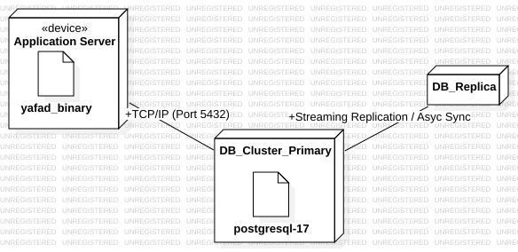
</p>

#### - Architecture
<p align="center">
  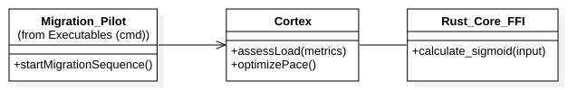
</p>

#### - Migration Flow
<p align="center">
  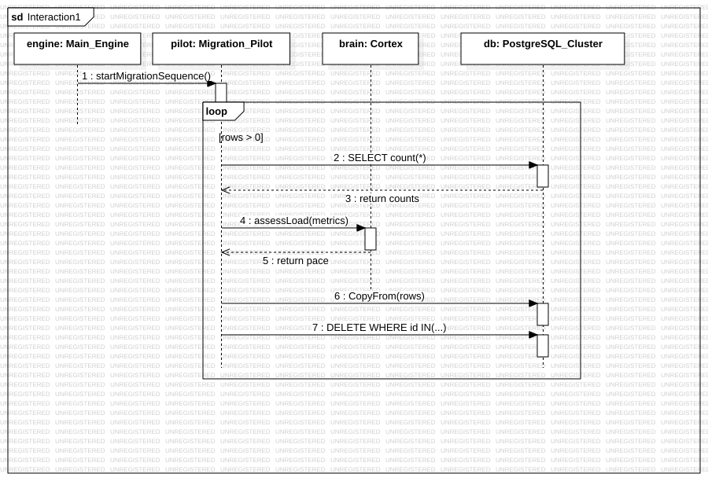
</p>

#### - Rust/Go integration
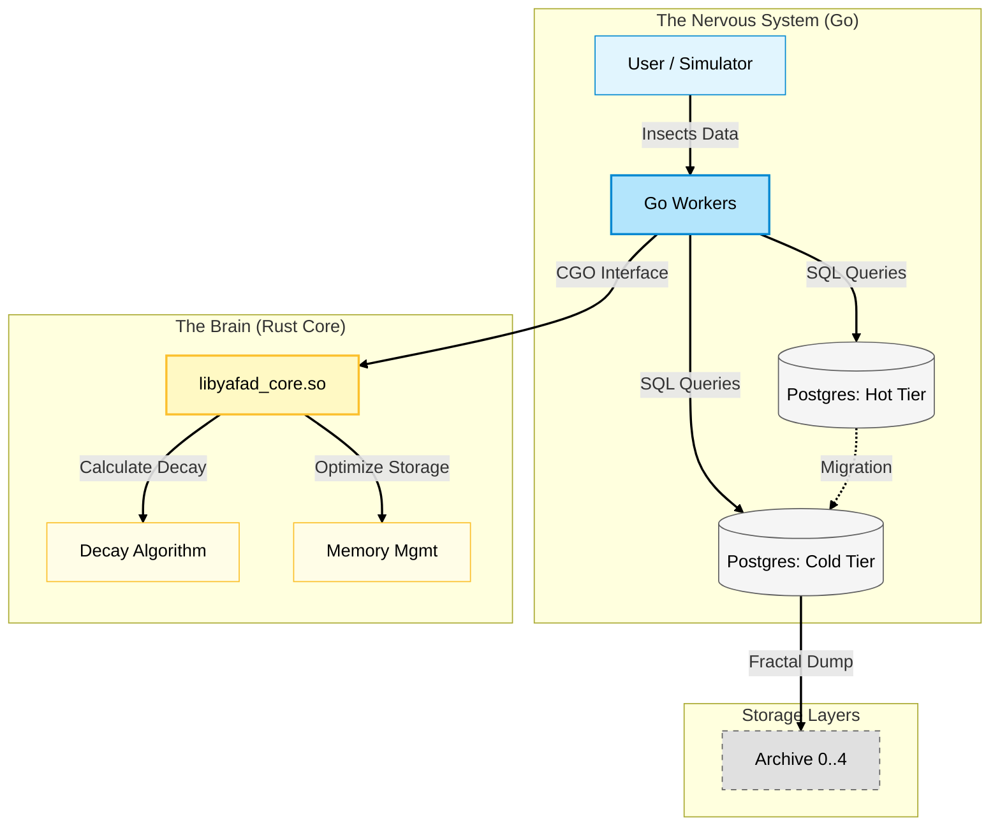


---
## 🚦 Usage & Evaluation

YaFaD_ai includes a comprehensive test suite to evaluate the Synaptic Buffer and Golden Ratio Cascading.

### 1. Prerequisites:

```bash
set -x DB_USER your_user
set -x DB_PASSWORD your_password
set -x DB_NAME yafad_test
```
### 2. Run the Suite (4 Terminals):

Terminal 1 (Setup): ```go run setup_db.go``` (First time: preparing DB)

Terminal 2 (Seeding): ```go run main.go``` (Start Core Engine, inject Mass)

Terminal 3 (Gravity): ```go run dashboard.go``` (Start Monitoring)

Terminal 4 (Traffic): ```go run user_simulator.go``` (Simulate Usage)

Terminal 5 (Fractal): ```go run fractal_decay.go``` (Deep Storage)

---

## 🛠 Troubleshooting CGO
Rust Linking: If you see ```undefined reference```, ensure ```core/src/lib.rs``` uses ```#[no_mangle]``` and ```extern "C"```.

Shared Object: If the program fails at startup, try: ```LD_LIBRARY_PATH=./core/target/release go run decay_worker.go```.

Database: If ```seed_db.go```` fails, run ```TRUNCATE buffer_tier, table0...``` in Postgres.

---

<div align="center">
  <h3>❤️ Support the Organism</h3>
  <p>YaFaD_ai is engineered to autonomously slash cloud storage waste. If you find this bio-inspired architecture fascinating, consider supporting its continued evolution.</p>
  <a href="https://github.com/sponsors/ErikSchiegg">
    
  </a>
</div>